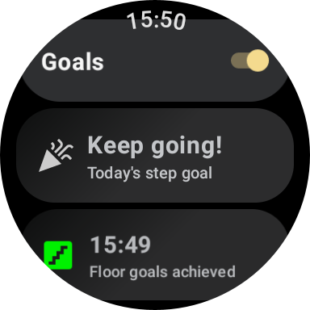
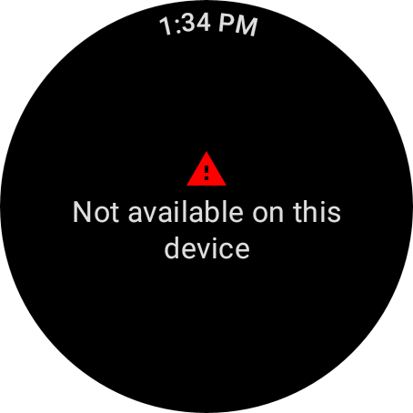

# Passive Goals Sample (Compose)

This sample demonstrates receiving passive goal notifications in the background using the
`PassiveMonitoringClient` API.

### Running the sample

You will need a Wear device with Health Services installed.

- Open the sample project in Android Studio.
- Plug in your Wear device and launch the app.

On startup, the app checks whether steps and floors data is available. If it is, you will see a
screen like this:



Use the switch to enable or disable goal subscriptions. Two separate goals are configured:

- Daily step goal: Notification for achieving 10,000 steps. This resets each day
- Floors goal: This goal notifies the user each time 3 floors have been climbed

On devices where steps and floors are not available, you will see a screen like this:



### Show synthetic data

With the sample running, you can turn on the synthetic data tracker by running the below command from
a shell. This will mimic the user performing an activity and generating steps data. Check the app UI
or logcat messages to see these data updates.

```shell
adb shell am broadcast \
-a "whs.USE_SYNTHETIC_PROVIDERS" \
com.google.android.wearable.healthservices
```

To set the "user" walking:
```shell
# walking
adb shell am broadcast \
-a "whs.synthetic.user.START_WALKING" \
com.google.android.wearable.healthservices
```

To stop using the synthetic tracker, run this command:
```shell
adb shell am broadcast -a \
"whs.USE_SENSOR_PROVIDERS" \
com.google.android.wearable.healthservices
```

## Troubleshooting

### App crashes with `java.lang.Exception: Not yet implemented`

This crash has been seen when using the Wear Emulator, in the scenario where the Health Services version on the emulator is extremely old:

```
E/AndroidRuntime: FATAL EXCEPTION: main
    Process: com.example.passivegoalscompose, PID: 30333
        java.lang.Exception: Not yet implemented
            at androidx.health.services.client.impl.internal.StatusCallback.onFailure(StatusCallback.kt:42)  
```

To resolve this issue, ensure you are using the [latest Wear image in your emulator](https://developer.android.com/studio/intro/update)

You can verify the version of Health Services using:

```
adb shell dumpsys package com.google.android.wearable.healthservices | grep versionCode
```

Ensure that this value is at least `70695`.